# Module 1: Bank Marketing Model - Complete ML Workflow on Cloudera AI

In this lab, you'll build a complete Machine Learning pipeline on Cloudera AI, from data ingestion through model deployment and inference.

Module 1 demonstrates real-world ML workflows using industry-standard tools and best practices.

## Overview

This lab walks you through building a **bank marketing prediction model** that classifies whether a customer will subscribe to a term deposit.

**Real-World Context:** This workflow mirrors how data scientists work in production environments, where data comes in, gets processed, models make predictions, and results feed downstream systems.

**Goals**

- [ ] **Ingest raw data** into a data lake
- [ ] **Explore and analyze** data with interactive notebooks
- [ ] **Train multiple models** using MLflow experiment tracking
- [ ] **Deploy models** as API endpoints with Cloudera AI
- [ ] **Process inference data** with feature engineering pipelines
- [ ] **Make predictions** and track results in production

## Lab structure

The lab is organized as a numbered sequence of scripts and notebooks:

| Step | File | Type | Purpose |
|------|------|------|---------|
| 1 | `01_ingest.py` | Python Script | Load raw data into the data lake |
| 2 | `02_eda_notebook.ipynb` | Jupyter Notebook | Explore and visualize data patterns |
| 3 | `03_train_quick.py` | Python Script | Train models with MLflow tracking |
| 4 | `04_deploy.py` | Python Script | Deploy best model as API endpoint |
| 5a | `05.1_inference_data_prep.py` | Python Script | Engineer features for inference |
| 5b | `05.2_inference_predict.py` | Python Script | Generate predictions from new data |
| 6 | `06_Inference_101.ipynb` | Jupyter Notebook | Interactive inference exploration |

!!! info
    Execute scripts in order. Each step builds on previous outputs.


!!! info
    All scripts for this module are in the `module1/` folder.


## Step-by-Step guide

### Pre setup

Follow the instructors guide to get you to this portal page.

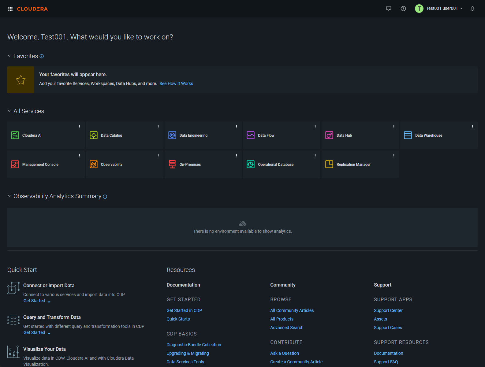

Click into **Cloudera AI** (new tab).

Open the Workbench (new tab).

Find your project and click into it.

<!-- The first thing you'll want to do is make yourself the project owner - follow the directions show below.

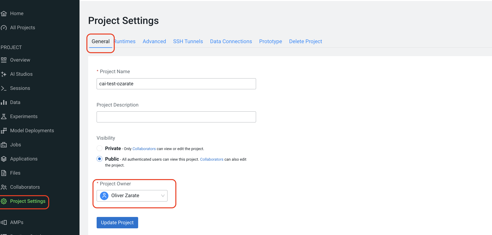 -->

Sync the Data Connections available for the project - follow the instructions below.

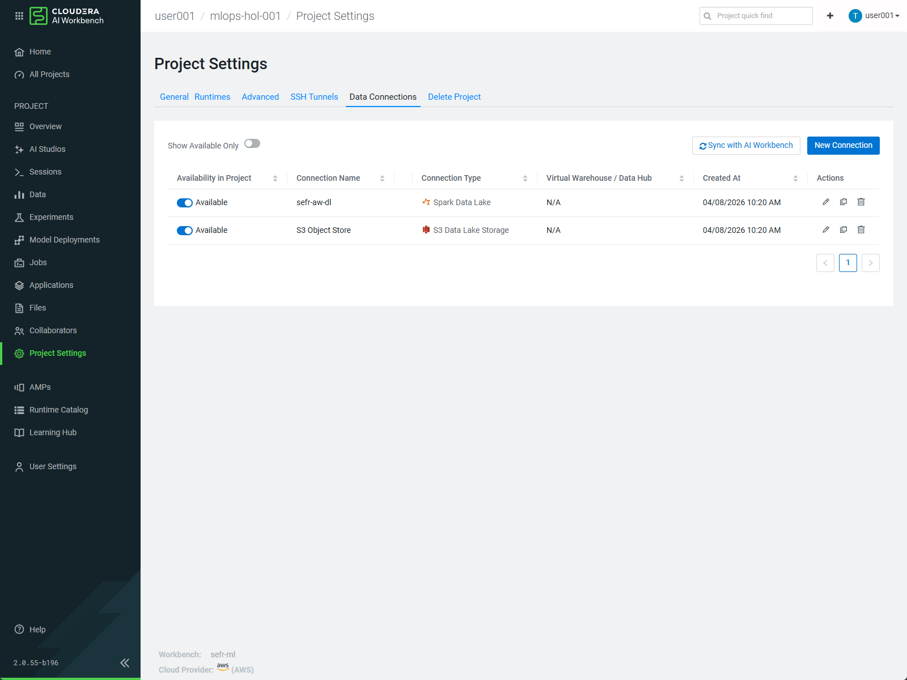

Open a session as follows. Make sure you enable Spark and pick the Spark 3.3.0 addon option.

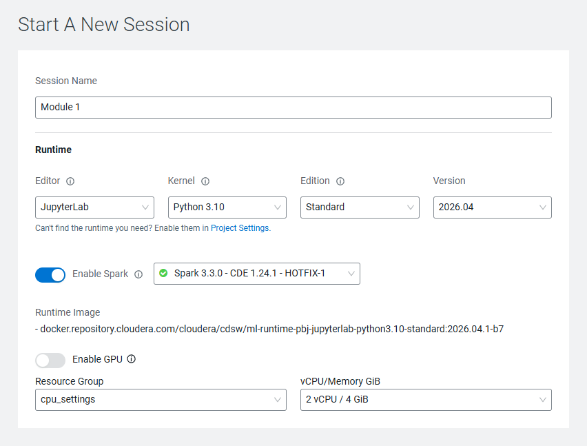

Once in the session, open up the terminal as shown below:

*Note: Throughout this lab always check you are in the right module folder. If you get a failure, check this first.*

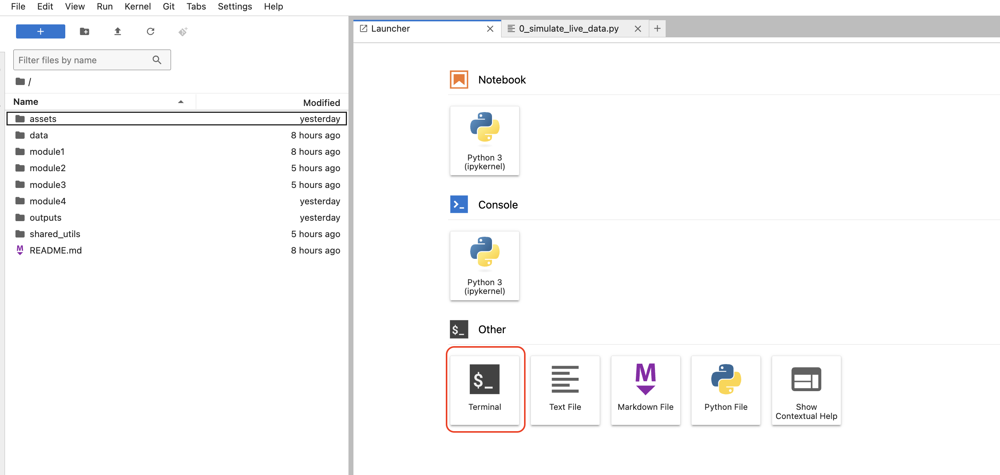

### Step 1: Data Ingestion

**Purpose:** Load raw bank marketing data and prepare it for analysis and training.

**What happens:**

1. Reads customer banking data from a CSV source
2. Creates a sample inference dataset (test customers)
3. Saves data to the Cloudera AI data lake
4. Validates data schema and quality

**To run:**

```bash
cd module1
python 01_ingest.py
```

**Expected output:**

```
------------------------------------------------------------
STEP 3: Write to Data Lake
------------------------------------------------------------

Writing to data lake with user: user001
Using connection: sefr-aw-dl
Setting spark.hadoop.yarn.resourcemanager.principal to user001
Spark Application Id:spark-204abfdf18fd44b8a5de5ed39bc5b07c
Spark DataFrame conversion: 6.37 seconds
Hive Session ID = fcf7235e-90cc-47a2-a959-bd03a309f90a
✓ Data written to DEFAULT_USER001.BANK_MARKETING_USER001
Iceberg write time: 39.86 seconds
Total data lake write time: 66.91 seconds

------------------------------------------------------------
STEP 4: Create Sample Inference Data
------------------------------------------------------------

Creating sample inference data...
✓ Sample inference data created
  Shape: (1000, 20)
  Columns: 20
  Saved to: inference_data/raw_inference_data.csv
  Creation time: 0.04 seconds

============================================================
EXECUTION SUMMARY
============================================================
End time: 2026-04-15 11:59:27
Total execution time: 70.03 seconds (1.17 minutes)
============================================================
✅ Ingestion complete!

Next steps:
  • Training pipeline: 02_eda_feature_engineering.ipynb → 03_train_quick.py
  • Inference pipeline: 05_inference_data_prep.py → 06_inference_predict.py
============================================================
```

**What you're creating:**

- `/module1/data/bank-additional/bank-additional-full.csv` - Complete training dataset (41,188 rows)
  - Features: Age, job, marital status, education, account balance, campaign details, economic indicators
  - Target: Whether customer subscribed to term deposit (yes/no)
- `/module1/inference_data/raw_inference_data.csv` - Sample inference data (1,000 rows)
  - Same features as training data
  - Used to simulate real-world prediction scenarios
  - Will be processed through the inference pipeline

**Why this matters:**

In production, raw data constantly flows into your data lake. This step simulates that process—you're setting up your data foundation for everything downstream.

### Step 2: Exploratory Data Analysis

**Purpose:** Understand data patterns, distributions, and relationships before building models.

**What happens:**

The Jupyter notebook `02_eda_notebook.ipynb` provides:

- Statistical summaries of features
- Distribution visualizations
- Correlation analysis
- Missing value assessment
- Business insights about customer behavior

**To run:**

```bash
# Open the notebook in your Cloudera AI project
# Click on: 02_eda_notebook.ipynb
# Run all cells to see the analysis
```

**Key Insights you'll discover:**

- Customer age distribution and campaign patterns
- Economic indicator trends
- Class imbalance in the target variable (important for training)
- Feature correlations with subscription likelihood

**Why this matters:**

EDA informs your entire ML pipeline. Understanding your data helps you:

- Identify which features matter most
- Spot data quality issues early
- Make informed decisions about preprocessing
- Validate if your model results make business sense

### Step 3: Model Training

**Purpose:** Train multiple models using MLflow to track experiments and find the best performer.

**What we're doing (in the interest of time):**

For this lab, we're using `03_train_quick.py` which trains a focused set of models quickly (~2-5 minutes). This version:

- Tests 1 model type (Logistic Regression) with multiple configurations
- Tests both baseline and engineered features
- Handles class imbalance with SMOTE
- Logs all experiments to MLflow

*Note: `03_train_extended.py` is available if you want to experiment with more model types (Random Forest, XGBoost, SVM, etc.) - it takes 15-30 minutes.*

**To run:**

```bash
python 03_train_quick.py
```

**Expected output:**

```
================================================================================
✅ QUICK TRAINING COMPLETE!

Total experiments run: 4

🔍 View experiments in MLflow UI:
  1. Run: mlflow ui
  2. Open: http://localhost:5000

💡 Tips for MLflow UI:
  • Use tags to filter: model_family, smote, features
  • Compare runs side-by-side
  • Sort by test_roc_auc to find best models

🚀 Ready for more? Try the extended version:
  python 03_train_extended.py

Next step: 04_deploy.py
================================================================================
```

**What gets logged:**

- Model parameters (regularization, solver, etc.)
- Performance metrics (accuracy, precision, recall, F1, ROC-AUC)
- Training time and data shapes
- Model artifacts (the actual trained model file)

**Next: Explore in Cloudera AI**

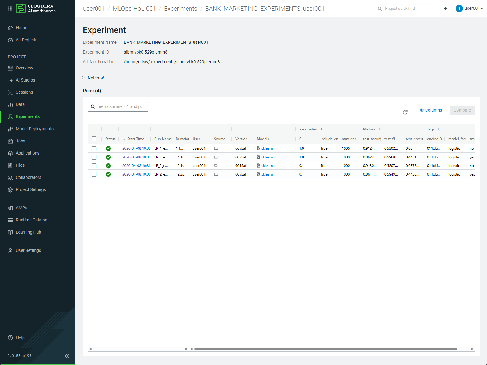

After running the training script:

1. Go to your Cloudera AI project
2. Click on **Experiments** in the left panel
3. Select **"BANK_MARKETING_EXPERIMENTS_<username>"**
4. You'll see all 4 experiment runs with their metrics
5. Compare F1 scores, ROC-AUC, and other metrics
6. Observe which feature engineering approach performs best

**Why this matters:**

MLflow is how data scientists track experiments at scale. In production:

- You run hundreds of experiments
- You need to compare results systematically
- You track which models were trained on which data
- You can reproduce any experiment later
- You select the best model for deployment

### Step 4: Model Deployment

**Purpose:** Take the best trained model and deploy it as an API endpoint so applications can request predictions.

**The Deployment Process:**

The deployment script (`04_deploy.py`) handles these steps automatically:

1. **Select Best Model**
   - Queries MLflow experiments
   - Finds the model with highest F1 score
   - Retrieves preprocessing artifacts

2. **Register the Model**
   - Saves model in MLflow Model Registry
   - Makes it available for deployment
   - Tracks model version and metadata

3. **Build Model Service**
   - Packages model with dependencies
   - Creates API endpoint configuration
   - Sets up monitoring and logging

4. **Deploy to Cloudera AI**
   - Registers model service in your project
   - Model becomes available as REST API
   - Can be called by applications for predictions

**To run:**

```bash
python 04_deploy.py
```

**Expected output:**

```
================================================================================
2026-04-15 12:49:07,180 - INFO - ✅ DEPLOYMENT COMPLETE!
✅ DEPLOYMENT COMPLETE!
================================================================================

📊 Model Summary:
   Model Name: banking_campaign_predictor
   F1 Score: 0.5968
   CML Model ID: 50cd5e4c-ff2a-4af8-b27a-0df04b9bcc72
   Build ID: 847bddae-4ac3-4922-a0d8-3e78c42e93c7
2026-04-15 12:49:07,180 - INFO - Model Summary:
2026-04-15 12:49:07,180 - INFO -   - Model Name: banking_campaign_predictor
2026-04-15 12:49:07,180 - INFO -   - F1 Score: 0.5968
2026-04-15 12:49:07,180 - INFO -   - CML Model ID: 50cd5e4c-ff2a-4af8-b27a-0df04b9bcc72
2026-04-15 12:49:07,180 - INFO -   - Build ID: 847bddae-4ac3-4922-a0d8-3e78c42e93c7
   Deployment ID: 8f811554-f82c-407d-baa5-ef8ba683c270

✅ REST API ENDPOINT IS LIVE!
   Access it: Models > banking_campaign_predictor > Deployments

🎯 Test your API:
   curl -X POST https://your-cml-workspace/models/...
2026-04-15 12:49:07,180 - INFO -   - Deployment ID: 8f811554-f82c-407d-baa5-ef8ba683c270
2026-04-15 12:49:07,180 - INFO - REST API endpoint is live!
2026-04-15 12:49:07,180 - INFO - Saving deployment info to outputs/deployment_info.json
2026-04-15 12:49:07,180 - INFO - Deployment info: {
  "run_id": "o0ta-ddwx-6bpp-96wl",
  "model_name": "banking_campaign_predictor",
  "registered_model_id": "z0vo-ioeh-sewq-045j",
  "model_version_id": "qcp6-vkl2-y7jc-o817",
  "f1_score": 0.5968028419182948,
  "cml_model_id": "50cd5e4c-ff2a-4af8-b27a-0df04b9bcc72",
  "build_id": "847bddae-4ac3-4922-a0d8-3e78c42e93c7",
  "deployment_id": "8f811554-f82c-407d-baa5-ef8ba683c270",
  "status": "Deployed"
}

💾 Saved to: outputs/deployment_info.json
💾 Debug log saved to: outputs/deployment_debug.log
================================================================================
2026-04-15 12:49:07,192 - INFO - ============================================================
2026-04-15 12:49:07,193 - INFO - Script completed successfully
2026-04-15 12:49:07,193 - INFO - ============================================================
```

**Next: Verify Deployment in Cloudera AI**

1. Go to your project's **Model Deployments** tab
2. Find the deployed model (bank_campaign_predictor)
3. Check the status (should be "Deployed")
4. Note the API endpoint URL
5. View logs and monitoring information

**Why this matters:**

This is where ML moves from experimental to operational:

- Your model is now a production service
- Other applications can query it for predictions
- You can monitor performance, response times, and errors
- You can update or roll back models safely

### ⚠️ Important: Configure your Model Endpoint

Before running the inference scripts in _Step 5_ and _Step 6_, you **must configure** your model endpoint credential `/shared_utils/config.py` file for your own deployed models.

**Step 1: Find your Model Endpoint**

1. In your Cloudera AI project, go to the **Model Deployments** tab
2. Click on your deployed model (e.g., "bank_campaign_predictor")
3. Click the **Overview** tab
4. In the  **Sample Code** section, you'll see code that looks like (Python):
   ```python
   r = requests.post('https://modelservice.ml-dbfc64d1-783.go01-dem.ylcu-atmi.cloudera.site/model',
                     data='{"accessKey":"mbtbh46x9h7wxj4cdkxz9fxl0nzmrefv",...}',
                     headers={'Content-Type': 'application/json'})
   ```

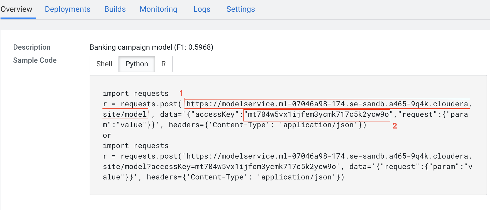

**Step 2: Extract your Credentials**

From the instructions above, copy:

- **model_endpoint**: The full URL (the https://... part)
- **access_key**: The accessKey value

**Step 3: Update `/shared_utils/config.py`**

Open `/shared_utils/config.py` and update the `MODEL_ENDPOINT_CONFIG` section with your credentials:

```python
# Model endpoint configuration for inference
# UPDATE THESE VALUES with your deployed model's endpoint and access key
MODEL_ENDPOINT_CONFIG = {
    "model_endpoint": "https://modelservice.ml-YOUR-ENDPOINT.cloudera.site/model",
    "access_key": "YOUR_ACCESS_KEY_HERE"
}
```

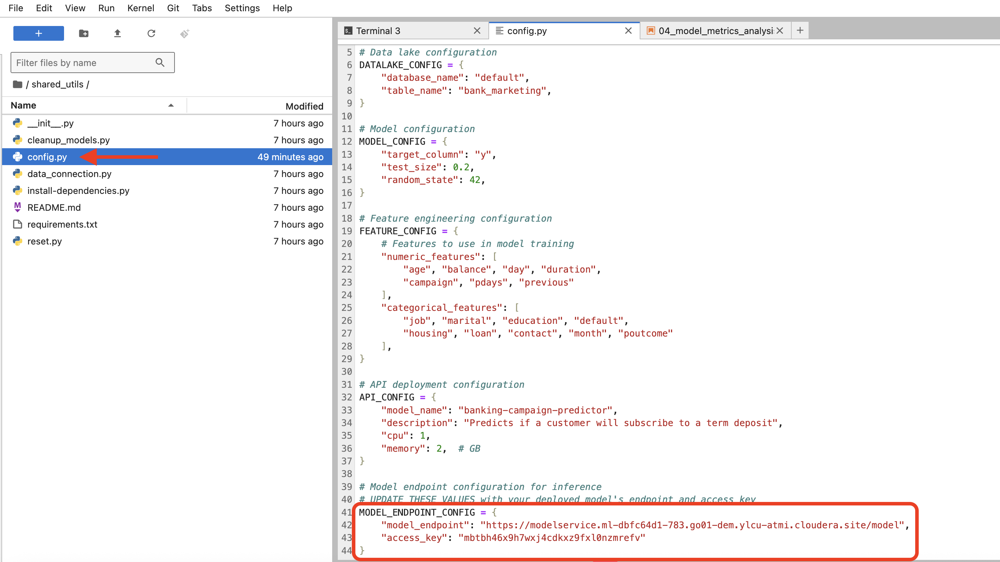

**Why this is important:**

Each deployed model has a unique endpoint and access key. Using the wrong credentials will cause inference requests to fail with authentication errors. This setup enables:

- [x] Secure API access (access key prevents unauthorized predictions)
- [x] Model tracking (each request is logged to your deployment)
- [x] Usage monitoring (see how many predictions are being made)
- [x] Resource management (limit concurrent requests)

### Step 5: Inference Pipeline

**Purpose:** Build an automated workflow that takes new customer data, prepares it, and generates predictions at scale.

!!! example "Lab Note"
    In this lab, we use the TRAINING DATA for inference demonstration to show you how the model
    responds and to validate the pipeline works end-to-end.

    IN PRODUCTION, you would NEVER feed training data back to a deployed model. This is lab-only practice to help you understand:

    - How data flows through the preprocessing pipeline
    - How the model generates predictions
    - How to interpret results and validate model behavior

    Real-world inference uses completely NEW, unseen data from actual customers or business
    scenarios. Training data is for model development only.

#### The Two-Job Pattern (Simulating real production)

In production, inference is typically broken into stages:

##### Job 1: Data Preparation (`05.1_inference_data_prep.py`)

**What it does:**

- Loads raw inference data (new customers to score)
- Applies feature engineering (same transformations as training)
  - Creates engagement scores
  - Generates age groups and economic categories
  - Creates duration categories
- Applies preprocessing (scaling and encoding)
- Outputs engineered data ready for the model

**Output file:**

```
/module1/inference_data/engineered_inference_data.csv
├── All 1,000 test customers
├── Original features (age, duration, campaign, etc.)
├── Engineered features (engagement_score, age_group, etc.)
└── Scaled and one-hot encoded for model input
```

##### Job 2: Generate Predictions (`05.2_inference_predict.py`)

**What it does:**

- Loads the engineered data from Job 1
- Loads the best trained model from MLflow
- Makes predictions on all records
- Generates probability scores
- Saves results with row tracking

**Output file:**

```
/module1/inference_data/predictions.csv
├── row_id: Unique identifier for each customer
├── prediction: 0 (won't subscribe) or 1 (will subscribe)
├── probability_class_0: Confidence for "no" prediction
├── probability_class_1: Confidence for "yes" prediction
└── prediction_label: Human-readable label (no/yes)
```

#### Job creation through the UI

We are going to create 2 jobs from 2 separate python script files and we're link a dependency as follows:

* Click on **Jobs** in the left panel of your Cloudera AI project

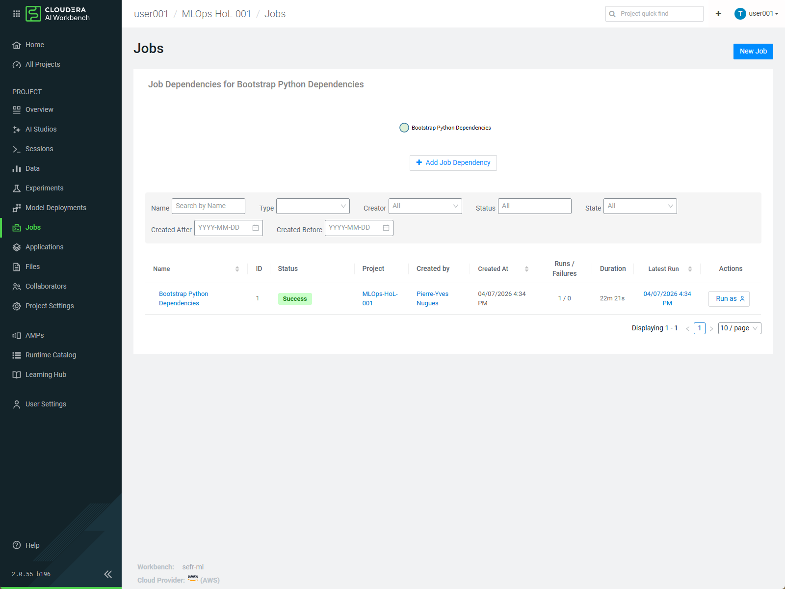

* Create New Job

* Set the name of the first Job to `inference data prep`. Use the file path `module1/05.1_inference_data_prep.py` for first job. Set Schedule to `Manual`.

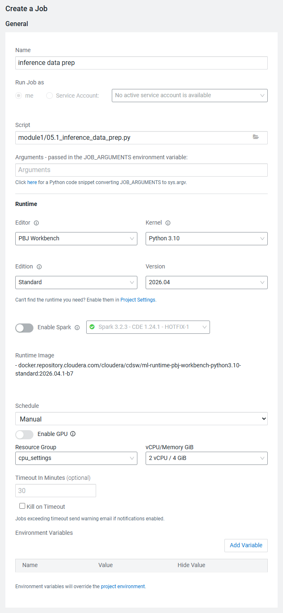

* Create the second job. Set the name of the first Job to `inference predict`. Use the file path `module1/05.2_inference_predict.py` for first job.

* Create a dependency to the first job by setting schedule to `Dependent` and specifying the first job.

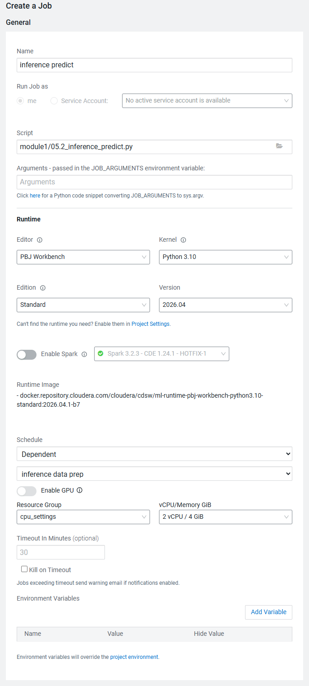

* You will see the dependencies of jobs set up.

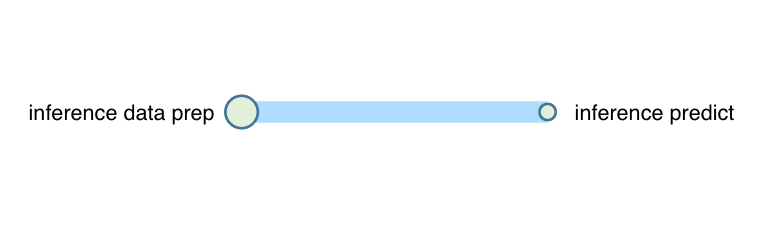

* Finally you can run by hitting '**Run as**' for the first job (inference data prep).

**Data Flow through the pipeline:**

```
Raw Data (1,000 customers)
         ↓
    [Job 1: Prepare]
    • Apply feature engineering
    • Engineered features created
    • Data scaled and encoded
         ↓
Engineered Data (1,000 customers)
         ↓
    [Job 2: Predict]
    • Load trained model
    • Generate predictions
    • Score probabilities
         ↓
Predictions (1,000 predictions + scores)
```

**Understanding the output files:**

!!! example "Lab Note"
    In this lab, `raw_inference_data.csv` contains records sampled from the training dataset for demonstration purposes.

    In production, inference data would come from completely separate sources (new customers, recent transactions, etc.) that the model has never seen during training.

1. `/module1/inference_data/raw_inference_data.csv` (Input)
    - Original customer features as they arrive
    - No feature engineering yet
    - This is what a production system would feed in
    - *In this lab: sampled from training data for demo purposes*

2. `/module1/inference_data/engineered_inference_data.csv` (Intermediate)
    - Same customers after feature engineering
    - New columns: engagement_score, age_group, etc.
    - Scaled and encoded for model input
    - Shows what transformations were applied

3. `/module1/inference_data/predictions.csv` (Output)
    - Final predictions ready for business use
    - Includes confidence scores
    - Traceable back to original customers via row_id
    - This is what goes to downstream systems

**Why this matters:**

In production:

- Inference often runs on schedules (hourly, daily, weekly)
- Data might come from multiple sources
- You need to transform new data exactly like training data
- Results feed into business applications
- You track data lineage to maintain reproducibility

### Step 6: Inference Deep Dive

**Purpose:** Explore the inference process interactively and understand how the model makes predictions.

!!! note
    This notebook demonstrates inference using a single record from the training data for educational purposes. In production, you'd use completely new, unseen customer data.

**Interactive exploration:**

The Jupyter notebook `06_Inference_101.ipynb` takes you through:

1. **Loading a single prediction**
    - Loads one test customer record
    - Shows original features
    - Shows engineering steps

2. **Feature engineering**
    - See how raw features are transformed
    - Understand engagement score calculation
    - View categorical encodings

3. **Preprocessing**
    - Observe scaling applied to numeric features
    - See one-hot encoding for categorical features
    - Compare before/after values

4. **Model prediction**
    - Send features to the model
    - Receive prediction and probabilities
    - Interpret confidence scores

**To run:**

```bash
# Open in Cloudera AI:
# Click: 06_Inference_101.ipynb
# Run all cells to walk through inference step-by-step
```

**What you'll learn:**

- How to prepare data for a trained model
- What happens inside the model
- How to interpret prediction scores
- How to handle edge cases

**A note about the model service:**

The model you deployed in Step 4 is hosted on Cloudera AI within your project. It's a REST API that handles:

- Request validation
- Feature preprocessing
- Model inference
- Response formatting
- Error handling
- Monitoring

In a real deployment, applications would query this endpoint continuously. Later in the lab (or in advanced modules), you'll explore Cloudera AI's inference service capabilities in more detail, including:

- Real-time endpoint monitoring
- A/B testing different models
- Batch prediction jobs
- Model versioning and rollback

## Understanding the Data Flow

Here's the complete journey of data through this lab:

```
┌─────────────────────────────────────────────────────────────┐
│                    STEP 1: DATA INGESTION                   │
│  Raw CSV → Validate → Save to Data Lake                     │
└──────────────────┬──────────────────────────────────────────┘
                   │
    ┌──────────────┴──────────────┐
    │                             │
    ↓                             ↓
┌──────────────────────┐  ┌──────────────────────┐
│  TRAINING DATA       │  │  INFERENCE DATA      │
│  41,188 rows         │  │  1,000 rows          │
│  (bank customers)    │  │  (test customers)    │
└──────────────────────┘  └──────────┬───────────┘
    │                                │
    ↓                                ↓
┌──────────────────────┐      ┌──────────────────────┐
│ STEP 2: EDA          │      │ STEP 5A: ENGINEER    │
│ Explore patterns     │      │ Apply transformations│
│ Visualize data       │      │ Create features      │
└──────────────┬───────┘      └──────────┬───────────┘
               │                         │
               ↓                         ↓
        ┌──────────────┐         ┌──────────────────────┐
        │ Insights     │         │ ENGINEERED DATA      │
        │ • Patterns   │         │ 1,000 rows           │
        │ • Imbalance  │         │ (with new features)  │
        │ • Key vars   │         └──────────┬───────────┘
        └──────────────┘                    │
                                           ↓
┌─────────────────────────────────────────────────────────────┐
│              STEP 3: MODEL TRAINING                         │
│  Baseline Features → Engineered Features → Compare Results  │
│  Test different configurations → Track with MLflow          │
└──────────────────┬──────────────────────────────────────────┘
                   │
                   ↓
        ┌─────────────────────────┐
        │ 8 EXPERIMENT RUNS       │
        │ Compare F1, ROC-AUC     │
        │ Select best model       │
        └──────────────┬──────────┘
                       │
                       ↓
┌─────────────────────────────────────────────────────────────┐
│              STEP 4: MODEL DEPLOYMENT                       │
│  Register Best Model → Package → Deploy to Cloudera AI      │
│  Result: REST API Endpoint Ready for Predictions            │
└──────────────────┬──────────────────────────────────────────┘
                   │
    ┌──────────────┴──────────────┐
    │                             │
    ↓                             ↓
┌──────────────────────┐  ┌──────────────────────┐
│ STEP 5B: PREDICT     │  │ STEP 6: DEEP DIVE    │
│ Load model           │  │ Interactive notebook │
│ Score 1,000 records  │  │ Explore predictions  │
│ Generate output      │  │ Understand features  │
└──────────────┬───────┘  └──────────────────────┘
               │
               ↓
        ┌─────────────────────────────┐
        │ PREDICTIONS OUTPUT          │
        │ 1,000 predictions + scores  │
        │ Ready for business use      │
        └─────────────────────────────┘
```

**Key Principles:**

- **Data lineage:** Track where data comes from at each step
- **Reproducibility:** Same preprocessing for training and inference
- **Feature engineering:** Applied consistently everywhere
- **Monitoring:** Track model performance over time

## Troubleshooting

Some common issues, and their solution is listed below.


### Common Issues and Solutions

#### Issue: "File not found" when running scripts

**Solution:**
Ensure you're in the `module1` directory:
```bash
cd module1
python 01_ingest.py
```

#### Issue: Script takes longer than expected or hangs

**Solution:**
Check that required packages are installed:
```bash
pip install pandas scikit-learn mlflow numpy
```

For training scripts specifically, this can be resource-intensive on slower systems. You can skip training and use pre-trained models if needed.

#### Issue: "MLflow experiment not found"

**Solution:**
Make sure you ran the training script first. Training creates the experiment and model artifacts.

#### Issue: Model deployment fails

**Solution:**
1. Verify the training script completed successfully
2. Check that the best model was logged to MLflow
3. Ensure you have proper credentials for Cloudera AI access

#### Issue: Inference script fails with "module not found"

**Solution:**
The inference scripts need the helpers module:
```bash
# Make sure you're in module1 directory
python 05_1_inference_data_prep.py
```

#### Issue: Jupyter notebook won't open

**Solution:**
Make sure you're using Cloudera AI's Jupyter interface. In your project, look for the "Open Workbench" or "Jupyter" button.

### Getting Help

If you encounter issues:

1. Check the error message carefully - it usually indicates the problem
2. Review the step-by-step guide for that section
3. Verify data files exist in the expected locations
4. Check the code comments in the script file
5. Ask your instructor or refer to Cloudera AI documentation

## Summary: What you've accomplished

By completing this lab, you've built a production-grade ML pipeline:

- [x] **Data Ingestion** - Loaded data into the data lake
- [x] **Data Analysis** - Explored patterns and insights
- [x] **Model Training** - Built and tracked multiple experiments
- [x] **Model Deployment** - Deployed to Cloudera AI
- [x] **Inference Preparation** - Built data transformation pipeline
- [x] **Inference Pipeline** - Generated predictions at scale
- [x] **Interactive Exploration** - Understood the prediction process

This is how real-world ML systems work. You've seen every step from raw data to production predictions.

## Next Steps

- **Advanced Training:** Use `03_train_extended.py` for more model types
- **Custom Features:** Modify feature engineering in the preprocessing module
- **Hyperparameter Tuning:** Adjust model parameters in training scripts
- **Model Monitoring:** Explore Cloudera AI's model monitoring dashboard
- **A/B Testing:** Deploy multiple models and compare performance

**Happy Learning!** 🚀

For more information, visit the [Cloudera AI Documentation](https://docs.cloudera.com/cml/).