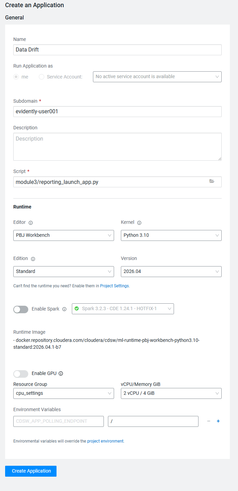

# Module 3: Proactive MLOps - The Automated Retraining Loop

## Overview

In Module 2, we *reacted* to poor model performance (accuracy). This module teaches **proactive MLOps**. We will build an event-driven pipeline that *proactively* detects **data drift** and uses that as a trigger to automatically retrain and deploy a new, smarter model.

This is a much more advanced and realistic workflow. We will make the "triggers" and "artifacts" visible at every step.

## Requirements

This module assumes you've completed:

- Module 1: Understanding how ML pipelines work (data -> training -> deployment)
- Module2: Learning to monitor models for performance degradation

You'll need the trained model and inference data from Module 1.

If you haven't completed these modules yet, [start with Module 1](../module1/README.md).

## Lab structure

The lab is organized as a numbered sequence of scripts and notebooks:

| Step | File | Type | Purpose |
|------|------|------|---------|
| 1a | `0_simulate_live_data.py` | Python Script | Simulate live data |
| 1b | `1_check_drift.py` | Python Script | Check for data drift |
| 2 | `reporting_launch_app.py` | Python Script | Launch Evidently report as application |
| 3 | `3_simulate_labeling_job.py` | Python Script | Simulate labeling job |
| 4 | `04_deploy.py` | Python Script | Deploy best model as API endpoint |
| 5a | `05.1_inference_data_prep.py` | Python Script | Engineer features for inference |
| 5b | `05.2_inference_predict.py` | Python Script | Generate predictions from new data |
| 6 | `06_Inference_101.ipynb` | Jupyter Notebook | Interactive inference exploration |

!!! info
    Execute scripts in order. Each step builds on previous outputs.

## Step-by-Step guide

**The MLOps pipeline we will build**. We will run a series of scripts that act as a real pipeline. Each script produces an artifact that the next script consumes.

!!! info
    All scripts for this module are in the `module3/` folder.

    All commands must be run from the **PROJECT ROOT** (`/home/cdsw`).

!!! info
    Ensure you have the `banking_train.csv` file in your project.

### Step 1: Simulate and detect drift

#### Job 0: Simulate live data with `0_simulate_live_data.py`

- **Action:** Simulates a batch of new, unlabeled production data with "drift" (new age patterns, new job categories).

- **Artifact:** Creates `/outputs/live_unlabeled_batch.csv`.

-  **Simulate live data:** Open a Cloudera AI Workbench terminal and run:
    ```bash
    python module3/0_simulate_live_data.py
    ```

- **Result:** Creates `/outputs/live_unlabeled_batch.csv`.

#### Job 1: Run Drift Check with `1_check_drift.py`

- **Action:** Reads both the banking_train.csv (reference) and the new live_unlabeled_batch.csv (current).

- **Detects:** Uses an *explicit* Evidently AI Test Suite to check for specific drift (e.g., in age and job).

- **Artifacts:**
    - `/1_drift_report_explicit.html`: A rich, visual dashboard of the drift.
    - `/outputs/drift_status.json`: A simple JSON file with {"status": "FAIL"}. This is our **pipeline trigger**.

- **Run Drift Check:** Now, run the monitoring job:
    ```bash
    python module3/1_check_drift.py
    ```

- **Observe:** The job will print **!!! DATA DRIFT DETECTED! !!!** and fail.

### Step 2: Publish the Visual Dashboard

#### Visualization application with `reporting_launch_app.py`

- **Action:** This script is *launched as a Cloudera AI Application*.

- **Result:** It hosts the 1_drift_report_explicit.html file on a permanent, shareable URL for the team to review.

- This is the "pro" MLOps step. Let's publish our report.

- **Setup and Cloudera AI Application:**
    1. Go to the **Applications** tab in your Cloudera AI project.
    2. Click **New Application**.
    3. Fill in the details:
        - **Name:** Data Drift
        - **Subdomain:** `evidently-<username>`
        - **Script:** `module3/reporting_launch_app.py`
        - **Editor:** PBJ Workbench
        - **Kernel:** Python 3.10
        - **Edition:** Standard
        - **Resource Profile:** (Smallest is fine)
    
    4. Click **Create Application**. After a moment, a URL will appear.

- **Launch the URL:** You will see your interactive Evidently report! This is what you would share with your team.

### Step 3: Trigger the Retraining Pipeline

Now we'll run the rest of the pipeline, which is "triggered" by the artifacts from Step 1.

#### Job 2: Run Label Acquisition with `3_simulate_labeling_job.py`

- **Trigger:** This job *first* reads outputs/drift_status.json.

- **Action:** If `status == "FAIL"`, it proceeds to simulate the data engineering work of acquiring labels for the new, drifted data.

- **Artifact:** Saves `/outputs/new_labeled_batch_01.csv`.

- **Run Label Acquisition:** Run the labelling job:
    ```bash
    python module3/3_simulate_labeling_job.py
    ```

#### Job 3: Run Retraining with `4_retrain_model.py`

- **Trigger:** "Triggered" by the creation of the new labeled data.

- **Action:** Combines the *original* training data with the *new* batch, trains a model, and logs it to an MLflow experiment.

- **Artifact:** Saves the MLflow run_id to `/outputs/retrain_run_info.json`.

- **Run Retraining:** Run the retraining job:
    ```bash
    python module3/4_retrain_model.py
    ```

#### Job 4: Run Register & Deploy with `5_register_and_deploy.py`

- **Trigger:** Reads the run_id from `/outputs/retrain_run_info.json`.

- **Action:** Uses the cmlapi client to register, build, and deploy the new model from that run_id.

- **Artifact:** A new, deployed banking_campaign_predictor model (same name, new build, new deployment).

- **Run Register & Deploy:** Run the register and deploy job:
    ```bash
    python module3/5_register_and_deploy.py
    ```

- **Observe:** This is the longest step. It will print its progress as it registers, builds, and deploys the new model.

### Step 4. Final Result & Verification

You have successfully simulated an end-to-end, event-driven MLOps pipeline.

1. Go to the **Model Deployments** tab in your Cloudera AI project.
2. You will see your existing model: **banking_campaign_predictor**.
3. Click on it. You will see that the new version has been **Built** and **Deployed**.
4. You now have a new, smarter model serving as an API endpoint, all triggered by a proactive drift detection test!

**Congratulations!**
